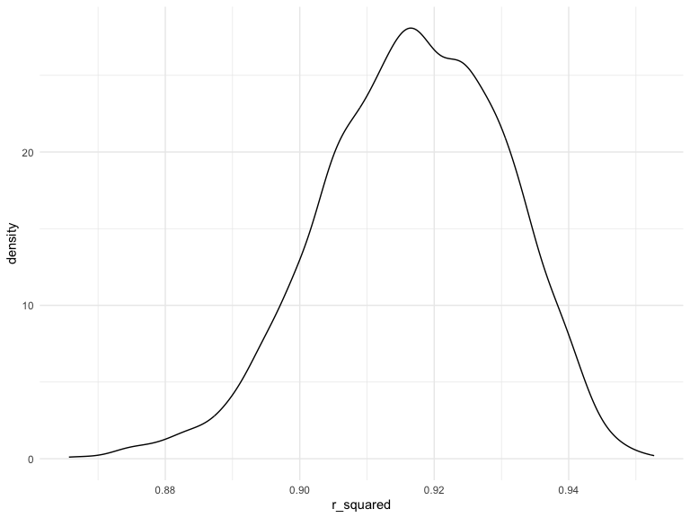
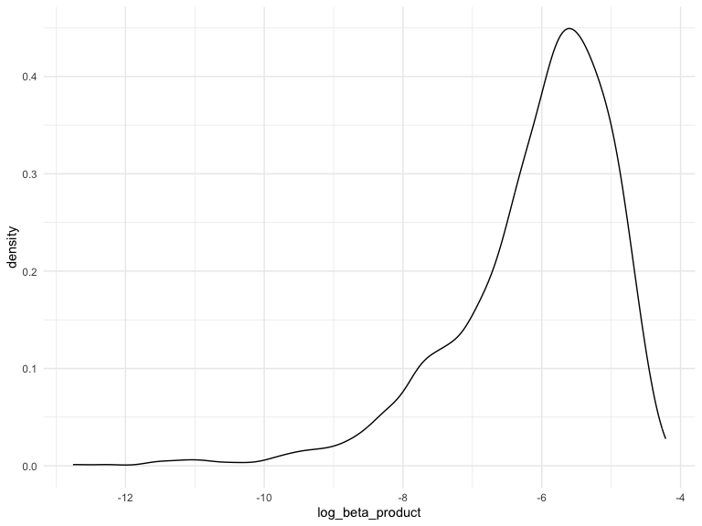
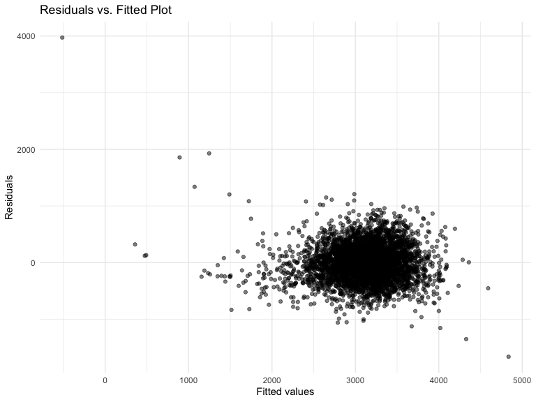
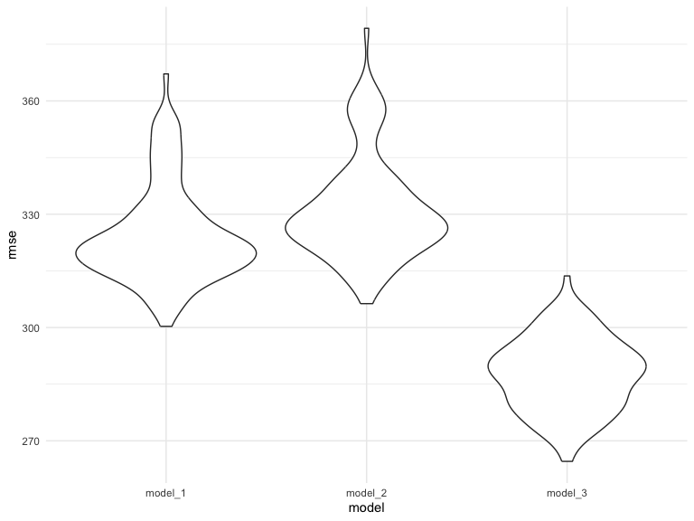

p8105_hw6_xz3173
================
Xue Zhang
2023-11-28

### Due date

Due: December 3 at 11:59pm.

### Points

| Problem   | Points |
|:----------|:-------|
| Problem 0 | 20     |
| Problem 1 | –      |
| Problem 2 | 40     |
| Problem 3 | 40     |

### Problem 0

This “problem” focuses on structure of your assignment, including the
use of R Markdown to write reproducible reports, the use of R Projects
to organize your work, the use of relative paths to load data, and the
naming structure for your files.

To that end:

- create a public GitHub repo + local R Project for this assignment
- write solutions using a .Rmd file that outputs a `github_document` /
  .md file
- submit a link to your repo via Courseworks

Your solutions to Problems 1 and 2 should be implemented in your .Rmd
file, and your git commit history should reflect the process you used to
solve these Problems.

For Problem 0, we will assess adherence to the instructions above
regarding repo structure, git commit history, and whether we are able to
knit your .Rmd to ensure that your work is reproducible. Adherence to
appropriate styling and clarity of code will be assessed in Problems 1+
using the homework [style rubric](homework_style_rubric.html).

This homework includes figures; the readability of your embedded plots
(e.g. font sizes, axis labels, titles) will be assessed in Problems 1+.

``` r
library(tidyverse)
library(modelr)
```

### Problem 1

In the data cleaning code below we create a `city_state` variable,
change `victim_age` to numeric, modifiy victim_race to have categories
white and non-white, with white as the reference category, and create a
`resolution` variable indicating whether the homicide is solved. Lastly,
we filtered out the following cities: Tulsa, AL; Dallas, TX; Phoenix,
AZ; and Kansas City, MO; and we retained only the variables
`city_state`, `resolution`, `victim_age`, `victim_sex`, and
`victim_race`.

``` r
homicide_df = 
  read_csv("data/homicide-data.csv", na = c("", "NA", "Unknown")) |> 
  mutate(
    city_state = str_c(city, state, sep = ", "),
    victim_age = as.numeric(victim_age),
    resolution = case_when(
      disposition == "Closed without arrest" ~ 0,
      disposition == "Open/No arrest"        ~ 0,
      disposition == "Closed by arrest"      ~ 1)
  ) |> 
  filter(victim_race %in% c("White", "Black")) |> 
  filter(!(city_state %in% c("Tulsa, AL", "Dallas, TX", "Phoenix, AZ", "Kansas City, MO"))) |> 
  select(city_state, resolution, victim_age, victim_sex, victim_race)
```

    ## Rows: 52179 Columns: 12
    ## ── Column specification ────────────────────────────────────────────────────────
    ## Delimiter: ","
    ## chr (8): uid, victim_last, victim_first, victim_race, victim_sex, city, stat...
    ## dbl (4): reported_date, victim_age, lat, lon
    ## 
    ## ℹ Use `spec()` to retrieve the full column specification for this data.
    ## ℹ Specify the column types or set `show_col_types = FALSE` to quiet this message.

Next we fit a logistic regression model using only data from Baltimore,
MD. We model `resolved` as the outcome and `victim_age`, `victim_sex`,
and `victim_race` as predictors. We save the output as `baltimore_glm`
so that we can apply `broom::tidy` to this object and obtain the
estimate and confidence interval of the adjusted odds ratio for solving
homicides comparing non-white victims to white victims.

``` r
baltimore_glm = 
  filter(homicide_df, city_state == "Baltimore, MD") |> 
  glm(resolution ~ victim_age + victim_sex + victim_race, family = binomial(), data = _)

baltimore_glm |> 
  broom::tidy() |> 
  mutate(
    OR = exp(estimate), 
    OR_CI_upper = exp(estimate + 1.96 * std.error),
    OR_CI_lower = exp(estimate - 1.96 * std.error)) |> 
  filter(term == "victim_sexMale") |> 
  select(OR, OR_CI_lower, OR_CI_upper) |>
  knitr::kable(digits = 3)
```

|    OR | OR_CI_lower | OR_CI_upper |
|------:|------------:|------------:|
| 0.426 |       0.325 |       0.558 |

Below, by incorporating `nest()`, `map()`, and `unnest()` into the
preceding Baltimore-specific code, we fit a model for each of the
cities, and extract the adjusted odds ratio (and CI) for solving
homicides comparing non-white victims to white victims. We show the
first 5 rows of the resulting dataframe of model results.

``` r
model_results = 
  homicide_df |> 
  nest(data = -city_state) |> 
  mutate(
    models = map(data, \(df) glm(resolution ~ victim_age + victim_sex + victim_race, 
                             family = binomial(), data = df)),
    tidy_models = map(models, broom::tidy)) |> 
  select(-models, -data) |> 
  unnest(cols = tidy_models) |> 
  mutate(
    OR = exp(estimate), 
    OR_CI_upper = exp(estimate + 1.96 * std.error),
    OR_CI_lower = exp(estimate - 1.96 * std.error)) |> 
  filter(term == "victim_sexMale") |> 
  select(city_state, OR, OR_CI_lower, OR_CI_upper)

model_results |>
  slice(1:5) |> 
  knitr::kable(digits = 3)
```

| city_state      |    OR | OR_CI_lower | OR_CI_upper |
|:----------------|------:|------------:|------------:|
| Albuquerque, NM | 1.767 |       0.831 |       3.761 |
| Atlanta, GA     | 1.000 |       0.684 |       1.463 |
| Baltimore, MD   | 0.426 |       0.325 |       0.558 |
| Baton Rouge, LA | 0.381 |       0.209 |       0.695 |
| Birmingham, AL  | 0.870 |       0.574 |       1.318 |

Below we generate a plot of the estimated ORs and CIs for each city,
ordered by magnitude of the OR from smallest to largest. From this plot
we see that most cities have odds ratios that are smaller than 1,
suggesting that crimes with male victims have smaller odds of resolution
compared to crimes with female victims after adjusting for victim age
and race. This disparity is strongest in New yrok. In roughly half of
these cities, confidence intervals are narrow and do not contain 1,
suggesting a significant difference in resolution rates by sex after
adjustment for victim age and race.

``` r
model_results |> 
  mutate(city_state = fct_reorder(city_state, OR)) |> 
  ggplot(aes(x = city_state, y = OR)) + 
  geom_point() + 
  geom_errorbar(aes(ymin = OR_CI_lower, ymax = OR_CI_upper)) + 
  theme(axis.text.x = element_text(angle = 90, hjust = 1))
```


### Problem 2

For this problem, we’ll use the Central Park weather data similar to
data we’ve seen elsewhere. The code chunk below (adapted from the course
website) will download these data.

``` r
weather_df = 
  rnoaa::meteo_pull_monitors(
    c("USW00094728"),
    var = c("PRCP", "TMIN", "TMAX"), 
    date_min = "2022-01-01",
    date_max = "2022-12-31") |>
  mutate(
    name = recode(id, USW00094728 = "CentralPark_NY"),
    tmin = tmin / 10,
    tmax = tmax / 10) |>
  select(name, id, everything())
```

    ## using cached file: /Users/xuezhang/Library/Caches/org.R-project.R/R/rnoaa/noaa_ghcnd/USW00094728.dly

    ## date created (size, mb): 2023-11-27 22:33:43.641167 (8.544)

    ## file min/max dates: 1869-01-01 / 2023-11-30

The boostrap is helpful when you’d like to perform inference for a
parameter / value / summary that doesn’t have an easy-to-write-down
distribution in the usual repeated sampling framework. We’ll focus on a
simple linear regression with tmax as the response with tmin and prcp as
the predictors, and are interested in the distribution of two quantities
estimated from these data:

r̂ 2 log(β̂ 1∗β̂ 2) Use 5000 bootstrap samples and, for each bootstrap
sample, produce estimates of these two quantities. Plot the distribution
of your estimates, and describe these in words. Using the 5000 bootstrap
estimates, identify the 2.5% and 97.5% quantiles to provide a 95%
confidence interval for r̂ 2 and log(β̂ 0∗β̂ 1) . Note: broom::glance() is
helpful for extracting r̂ 2 from a fitted regression, and broom::tidy()
(with some additional wrangling) should help in computing log(β̂ 1∗β̂ 2) .

``` r
set.seed(1)

# Bootstrap for r_squared
bootstrap_results =
  weather_df |>
  modelr::bootstrap(n = 5000) |>
  mutate(
    models = map(strap, \(df) lm(tmax ~ tmin + prcp, data = df) ),
    results = map(models, broom::glance)) |>
  select(-strap, -models) |>
  unnest(results)

# Pull r_squared
r_squared = 
  bootstrap_results |>
  pull(r.squared) 

# Plot of r_squared
bootstrap_results |>
  ggplot(aes(x = r_squared)) +
  geom_density()
```



**The distribution of `r_squared` values from the 5000 bootstrap samples
indicates a strong average model performance, with the mean `r_squared`
around 0.9168349, which indicates a better fit of the model to the data.
This high mean value suggests that, on average, the model explains a
large portion of the variance in the response variable `tmax` using
predictors `tmin` and `prcp`. The distribution of these `r_squared`
values is approximately across the bootstrap samples.**

``` r
# Confidence interval for r_squared
bootstrap_results |>
  summarize(
    r_squared_ci_lower = quantile(r_squared, 0.025),
    r_squared_ci_upper = quantile(r_squared, 0.975)) |>
  knitr::kable(digits = 3)
```

| r_squared_ci_lower | r_squared_ci_upper |
|-------------------:|-------------------:|
|              0.889 |              0.941 |

**The 95% confidence interval for `r_squared` indicates that we can be
95% confident that the true coefficient of determination `r_squared` for
the population lies between `0.889` and `0.941`. These high values of
`r_squared` suggest that the model, with `tmin` and `prcp` as
predictors, does a good job of explaining the variability in `tmax`.**

``` r
# Bootstrap for log_beta_products
bootstrap_results =
  weather_df |>
  modelr::bootstrap(n = 5000) |>
  mutate(
    models = map(strap, \(df) lm(tmax ~ tmin + prcp, data = df) ),
    results = map(models, broom::tidy)) |>
  select(-strap, -models) |>
  unnest(results) |>
  select(id = `.id`, term, estimate) |>
  pivot_wider(
    names_from = term,
    values_from = estimate) |>
  rename(beta_1 = tmin, beta_2 = prcp) |>
  filter(beta_1 * beta_2 > 0) |>
  mutate(log_beta_product = log(beta_1 * beta_2)) 
```

``` r
# Plot of log_beta_product
bootstrap_results |>
  ggplot(aes(x = log_beta_product)) +
  geom_density()
```



**The distribution of `log_beta_products` from the 5000 bootstrap
samples, after filtering out instances where the product of `beta_1` and
`beta_2` is non-positive, shows a left-skewed (or negatively skewed)
pattern. This skewness is characterized by a longer tail extending
towards lower values, with the majority of the data points and the
median skewed towards the right. The median of the distribution is
approximately -5.8305305, which suggests that, while most bootstrap
samples indicate a certain level of combined effect of `tmin` and `prcp`
on `tmax`, there are a notable number of samples where this combined
effect is smaller. This left skewness can imply that in several
instances, the interaction or combined influence of `tmin` and `prcp` is
less pronounced than what is observed on average in the dataset.**

**It’s important to consider that the filtering criteria may have
excluded cases where the product of `beta_1` and `beta_2` is
non-positive, may have impacted the analysis. This exclusion potentially
omits scenarios where the predictors have an inverse or negligible
combined effect on the response variable, possibly leading to a skewed
representation of their interaction.**

**In the context of this analysis, the observed left skewness in the
distribution of `log_beta_products` suggests that while the combined
effect of `tmin` and `prcp` generally contributes positively to `tmax`,
the strength of this relationship varies, with a noteworthy number of
instances exhibiting a less-than-average effect. This variation
underscores the complexity of the relationship between these variables
and highlights the need to consider a range of scenarios when
interpreting the impact of `tmin` and `prcp` on `tmax`.**

``` r
# Confidence Interval for log_beta_product
bootstrap_results |>
  summarize(
    log_beta_product_ci_lower = quantile(log_beta_product, 0.025),
    log_beta_product_ci_upper = quantile(log_beta_product, 0.975)) |>
  knitr::kable(digits = 3)
```

| log_beta_product_ci_lower | log_beta_product_ci_upper |
|--------------------------:|--------------------------:|
|                    -8.885 |                    -4.604 |

**The 95% confidence interval for `log_beta_products` suggests that we
can be 95% confident that the true value of `log_beta_products` lies
between`-8.885`and `-4.604`in the population from the sample. The
negative values here indicate that the product of `beta_1` and `beta_2`
is typically less than1, as the logarithm of a number less than 1 is
negative. This might suggest a less pronounced or even an inverse
relationship between the combined effect of the predictors and the
response variable.**

### Problem 3

In this problem, you will analyze data gathered to understand the
effects of several variables on a child’s birthweight. This dataset,
available here, consists of roughly 4000 children and includes the
following variables:

babysex: baby’s sex (male = 1, female = 2) bhead: baby’s head
circumference at birth (centimeters) blength: baby’s length at birth
(centimeteres) bwt: baby’s birth weight (grams) delwt: mother’s weight
at delivery (pounds) fincome: family monthly income (in hundreds,
rounded) frace: father’s race (1 = White, 2 = Black, 3 = Asian, 4 =
Puerto Rican, 8 = Other, 9 = Unknown) gaweeks: gestational age in weeks
malform: presence of malformations that could affect weight (0 = absent,
1 = present) menarche: mother’s age at menarche (years) mheigth:
mother’s height (inches) momage: mother’s age at delivery (years) mrace:
mother’s race (1 = White, 2 = Black, 3 = Asian, 4 = Puerto Rican, 8 =
Other) parity: number of live births prior to this pregnancy pnumlbw:
previous number of low birth weight babies pnumgsa: number of prior
small for gestational age babies ppbmi: mother’s pre-pregnancy BMI ppwt:
mother’s pre-pregnancy weight (pounds) smoken: average number of
cigarettes smoked per day during pregnancy wtgain: mother’s weight gain
during pregnancy (pounds)

Load and clean the data for regression analysis (i.e. convert numeric to
factor where appropriate, check for missing data, etc.).

``` r
# Load data
birth_weight_df =
  read_csv("./data/birthweight.csv")
```

    ## Rows: 4342 Columns: 20
    ## ── Column specification ────────────────────────────────────────────────────────
    ## Delimiter: ","
    ## dbl (20): babysex, bhead, blength, bwt, delwt, fincome, frace, gaweeks, malf...
    ## 
    ## ℹ Use `spec()` to retrieve the full column specification for this data.
    ## ℹ Specify the column types or set `show_col_types = FALSE` to quiet this message.

``` r
# Convert Numeric to Factor
birth_weight_df = birth_weight_df |>
  mutate(
    babysex = as.factor(babysex),
    frace = as.factor(frace),
    mrace = as.factor(mrace),
    malform = as.factor(malform)
  )

# Check for missing data
# colSums(is.na(birth_weight_df))
# There are no missing data
```

Propose a regression model for birthweight. This model may be based on a
hypothesized structure for the factors that underly birthweight, on a
data-driven model-building process, or a combination of the two.
Describe your modeling process and show a plot of model residuals
against fitted values – use add_predictions and add_residuals in making
this plot.

``` r
# Example of starting with a simple linear regression model
model_1 = lm(bwt ~ blength + delwt + gaweeks + ppbmi + smoken, data = birth_weight_df)
```

**This `model_1` incorporates a mix of baby’s measurements at birth and
maternal factors. The inclusion of maternal smoking (`smoken`) and
pre-pregnancy BMI (`ppbmi`) could be particularly insightfful, as they
are controllable factors that may significantly birth weight.**

``` r
# Add predictions and residuals
model_1_df = birth_weight_df |>
  add_predictions(model_1) |>
  add_residuals(model_1)

# Plot of residuals against fitted value
model_1_df |>
  ggplot(aes(x = pred, y = resid)) +
  geom_point(alpha = .5) +
  labs(x = "Fitted values", y = "Residuals", title = "Residuals vs. Fitted Plot")
```



**The plot of residuals against fitted values for `model_1` did not show
any clear patterns, suggesting that the model’s assumptions(linearity,
homoscedasticity) were reasonably met. However, some outliers were
noted, indicating specific cases where the model’s predictions were less
accurate.**

Compare your model to two others:

One using length at birth and gestational age as predictors (main
effects only)

``` r
model_2 = lm(bwt ~ blength + gaweeks, data = birth_weight_df)
```

One using head circumference, length, sex, and all interactions
(including the three-way interaction) between these

``` r
model_3 = lm(bwt ~ bhead * blength * babysex, data = birth_weight_df)
```

Make this comparison in terms of the cross-validated prediction error;
use crossv_mc and functions in purrr as appropriate.

Note that although we expect your model to be reasonable, model building
itself is not a main idea of the course and we don’t necessarily expect
your model to be “optimal”.

``` r
# Cross-validation for each model
cv_df = 
  crossv_mc(birth_weight_df, 100) |>
  mutate(
    train = map(train, as_tibble),
    test = map(test, as_tibble))
```

``` r
cv_df = 
  cv_df |>
  mutate(
    model_1 = map(train, \(df) lm(bwt ~ blength + delwt + gaweeks + ppbmi + smoken, data = df)),
    model_2 = map(train, \(df) lm(bwt ~ blength + gaweeks, data = df)),
    model_3 = map(train, \(df) lm(bwt ~ bhead * blength * babysex, data = df))) |>
  
  # Compute RMSE for each model
  mutate(
    rmse_model_1 = map2_dbl(model_1, test, \(mod, df) rmse(model = mod, data = df)),
    rmse_model_2 = map2_dbl(model_2, test, \(mod, df) rmse(model = mod, data = df)),
    rmse_model_3 = map2_dbl(model_3, test, \(mod, df) rmse(model = mod, data = df)))
```

``` r
cv_df |>
  select(starts_with("rmse")) |>
  pivot_longer(
    everything(),
    names_to = "model",
    values_to = "rmse",
    names_prefix = "rmse_") |>
  mutate(model = fct_inorder(model)) |>
  ggplot(aes(x = model, y = rmse)) + 
  geom_violin()
```



The violin plot provides a visual comparison of the RMSE distribution
across models. A model with consistently lower RMSE values across
cross-validation folds is generally preferred. However, also consider
the spread of the errors – a tighter distribution might be favorable.

**The `model_3` shows the lowest RMSE values on average, suggesting that
it has the best predictive accuracy among the three models. This
indicates that the combination of head circumference, length, sex, and
especially their interactions, is important in predicting birth weight.
the interactions might capture complex relationships that are
significant in determining birth weight.**

**The `model_1` and `model_2`, while having higher RMSE values compared
to `model_3`, exhibit a tighter distribution of these values. This
suggests that these models, despite being simpler, offer more consistent
predictions across different subsets of data. The tighter distribution
points to reliability, as the variation in their predictive performance
is less.**

**The `model_3`, despite its complexity, provides better average
predictions but possibly with more variability (wider RMSE
distribution). On the other hand, the `model_1` and `model_2`, while
simpler and with slightly less predictive accuracy, offer more
consistent predictions.**

**In conclusion, `model_3` would be preferred if the primary goal is to
minimize prediction error. `model_1` or `model_2` might be more suitable
if consistency and interpretability are more critical.**
