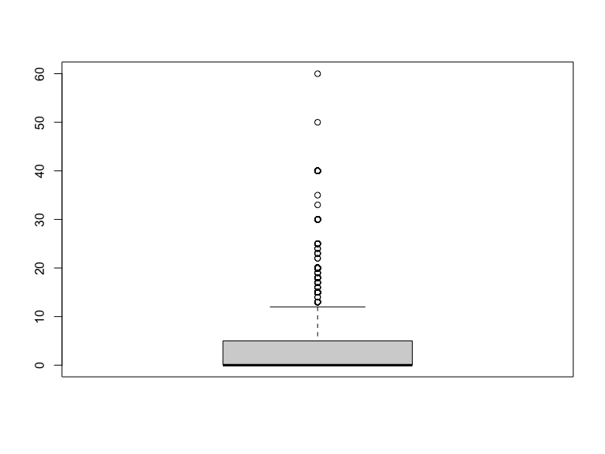

p8105_hw6_xz3173
================
Xue Zhang
2023-11-28

### Due date

Due: December 3 at 11:59pm.

### Points

| Problem   | Points |
|:----------|:-------|
| Problem 0 | 20     |
| Problem 1 | –      |
| Problem 2 | 40     |
| Problem 3 | 40     |

### Problem 0

This “problem” focuses on structure of your assignment, including the
use of R Markdown to write reproducible reports, the use of R Projects
to organize your work, the use of relative paths to load data, and the
naming structure for your files.

To that end:

- create a public GitHub repo + local R Project for this assignment
- write solutions using a .Rmd file that outputs a `github_document` /
  .md file
- submit a link to your repo via Courseworks

Your solutions to Problems 1 and 2 should be implemented in your .Rmd
file, and your git commit history should reflect the process you used to
solve these Problems.

For Problem 0, we will assess adherence to the instructions above
regarding repo structure, git commit history, and whether we are able to
knit your .Rmd to ensure that your work is reproducible. Adherence to
appropriate styling and clarity of code will be assessed in Problems 1+
using the homework [style rubric](homework_style_rubric.html).

This homework includes figures; the readability of your embedded plots
(e.g. font sizes, axis labels, titles) will be assessed in Problems 1+.

``` r
library(tidyverse)
library(modelr)
```

### Problem 1

In the data cleaning code below we create a `city_state` variable,
change `victim_age` to numeric, modifiy victim_race to have categories
white and non-white, with white as the reference category, and create a
`resolution` variable indicating whether the homicide is solved. Lastly,
we filtered out the following cities: Tulsa, AL; Dallas, TX; Phoenix,
AZ; and Kansas City, MO; and we retained only the variables
`city_state`, `resolution`, `victim_age`, `victim_sex`, and
`victim_race`.

``` r
homicide_df = 
  read_csv("data/homicide-data.csv", na = c("", "NA", "Unknown")) |> 
  mutate(
    city_state = str_c(city, state, sep = ", "),
    victim_age = as.numeric(victim_age),
    resolution = case_when(
      disposition == "Closed without arrest" ~ 0,
      disposition == "Open/No arrest"        ~ 0,
      disposition == "Closed by arrest"      ~ 1)
  ) |> 
  filter(victim_race %in% c("White", "Black")) |> 
  filter(!(city_state %in% c("Tulsa, AL", "Dallas, TX", "Phoenix, AZ", "Kansas City, MO"))) |> 
  select(city_state, resolution, victim_age, victim_sex, victim_race)
```

    ## Rows: 52179 Columns: 12
    ## ── Column specification ────────────────────────────────────────────────────────
    ## Delimiter: ","
    ## chr (8): uid, victim_last, victim_first, victim_race, victim_sex, city, stat...
    ## dbl (4): reported_date, victim_age, lat, lon
    ## 
    ## ℹ Use `spec()` to retrieve the full column specification for this data.
    ## ℹ Specify the column types or set `show_col_types = FALSE` to quiet this message.

Next we fit a logistic regression model using only data from Baltimore,
MD. We model `resolved` as the outcome and `victim_age`, `victim_sex`,
and `victim_race` as predictors. We save the output as `baltimore_glm`
so that we can apply `broom::tidy` to this object and obtain the
estimate and confidence interval of the adjusted odds ratio for solving
homicides comparing non-white victims to white victims.

``` r
baltimore_glm = 
  filter(homicide_df, city_state == "Baltimore, MD") |> 
  glm(resolution ~ victim_age + victim_sex + victim_race, family = binomial(), data = _)

baltimore_glm |> 
  broom::tidy() |> 
  mutate(
    OR = exp(estimate), 
    OR_CI_upper = exp(estimate + 1.96 * std.error),
    OR_CI_lower = exp(estimate - 1.96 * std.error)) |> 
  filter(term == "victim_sexMale") |> 
  select(OR, OR_CI_lower, OR_CI_upper) |>
  knitr::kable(digits = 3)
```

|    OR | OR_CI_lower | OR_CI_upper |
|------:|------------:|------------:|
| 0.426 |       0.325 |       0.558 |

Below, by incorporating `nest()`, `map()`, and `unnest()` into the
preceding Baltimore-specific code, we fit a model for each of the
cities, and extract the adjusted odds ratio (and CI) for solving
homicides comparing non-white victims to white victims. We show the
first 5 rows of the resulting dataframe of model results.

``` r
model_results = 
  homicide_df |> 
  nest(data = -city_state) |> 
  mutate(
    models = map(data, \(df) glm(resolution ~ victim_age + victim_sex + victim_race, 
                             family = binomial(), data = df)),
    tidy_models = map(models, broom::tidy)) |> 
  select(-models, -data) |> 
  unnest(cols = tidy_models) |> 
  mutate(
    OR = exp(estimate), 
    OR_CI_upper = exp(estimate + 1.96 * std.error),
    OR_CI_lower = exp(estimate - 1.96 * std.error)) |> 
  filter(term == "victim_sexMale") |> 
  select(city_state, OR, OR_CI_lower, OR_CI_upper)

model_results |>
  slice(1:5) |> 
  knitr::kable(digits = 3)
```

| city_state      |    OR | OR_CI_lower | OR_CI_upper |
|:----------------|------:|------------:|------------:|
| Albuquerque, NM | 1.767 |       0.831 |       3.761 |
| Atlanta, GA     | 1.000 |       0.684 |       1.463 |
| Baltimore, MD   | 0.426 |       0.325 |       0.558 |
| Baton Rouge, LA | 0.381 |       0.209 |       0.695 |
| Birmingham, AL  | 0.870 |       0.574 |       1.318 |

Below we generate a plot of the estimated ORs and CIs for each city,
ordered by magnitude of the OR from smallest to largest. From this plot
we see that most cities have odds ratios that are smaller than 1,
suggesting that crimes with male victims have smaller odds of resolution
compared to crimes with female victims after adjusting for victim age
and race. This disparity is strongest in New yrok. In roughly half of
these cities, confidence intervals are narrow and do not contain 1,
suggesting a significant difference in resolution rates by sex after
adjustment for victim age and race.

``` r
model_results |> 
  mutate(city_state = fct_reorder(city_state, OR)) |> 
  ggplot(aes(x = city_state, y = OR)) + 
  geom_point() + 
  geom_errorbar(aes(ymin = OR_CI_lower, ymax = OR_CI_upper)) + 
  theme(axis.text.x = element_text(angle = 90, hjust = 1))
```


### Problem 2

For this problem, we’ll use the Central Park weather data similar to
data we’ve seen elsewhere. The code chunk below (adapted from the course
website) will download these data.

``` r
weather_df = 
  rnoaa::meteo_pull_monitors(
    c("USW00094728"),
    var = c("PRCP", "TMIN", "TMAX"), 
    date_min = "2022-01-01",
    date_max = "2022-12-31") |>
  mutate(
    name = recode(id, USW00094728 = "CentralPark_NY"),
    tmin = tmin / 10,
    tmax = tmax / 10) |>
  select(name, id, everything())
```

    ## using cached file: /Users/xuezhang/Library/Caches/org.R-project.R/R/rnoaa/noaa_ghcnd/USW00094728.dly

    ## date created (size, mb): 2023-11-27 22:33:43.641167 (8.544)

    ## file min/max dates: 1869-01-01 / 2023-11-30

The boostrap is helpful when you’d like to perform inference for a
parameter / value / summary that doesn’t have an easy-to-write-down
distribution in the usual repeated sampling framework. We’ll focus on a
simple linear regression with tmax as the response with tmin and prcp as
the predictors, and are interested in the distribution of two quantities
estimated from these data:

r̂ 2 log(β̂ 1∗β̂ 2) Use 5000 bootstrap samples and, for each bootstrap
sample, produce estimates of these two quantities. Plot the distribution
of your estimates, and describe these in words. Using the 5000 bootstrap
estimates, identify the 2.5% and 97.5% quantiles to provide a 95%
confidence interval for r̂ 2 and log(β̂ 0∗β̂ 1) . Note: broom::glance() is
helpful for extracting r̂ 2 from a fitted regression, and broom::tidy()
(with some additional wrangling) should help in computing log(β̂ 1∗β̂ 2) .

``` r
set.seed(1)

# Bootstrap for r_squared
bootstrap_results =
  weather_df |>
  modelr::bootstrap(n = 5000) |>
  mutate(
    models = map(strap, \(df) lm(tmax ~ tmin + prcp, data = df) ),
    results = map(models, broom::glance)) |>
  select(-strap, -models) |>
  unnest(results)

# Pull r_squared
r_squared = 
  bootstrap_results |>
  pull(r.squared) 

# Plot of r_squared
bootstrap_results |>
  ggplot(aes(x = r_squared)) +
  geom_density()
```


``` r
# Confidence interval for r_squared
bootstrap_results |>
  summarize(
    r_squared_ci_lower = quantile(r_squared, 0.025),
    r_squared_ci_upper = quantile(r_squared, 0.975))
```

    ## # A tibble: 1 × 2
    ##   r_squared_ci_lower r_squared_ci_upper
    ##                <dbl>              <dbl>
    ## 1              0.889              0.941

``` r
# Bootstrap for log_beta_products
bootstrap_results =
  weather_df |>
  modelr::bootstrap(n = 5000) |>
  mutate(
    models = map(strap, \(df) lm(tmax ~ tmin + prcp, data = df) ),
    results = map(models, broom::tidy)) |>
  select(-strap, -models) |>
  unnest(results)


# Pull beta_1
beta_1 =
  bootstrap_results |>
  filter(term == "tmin") |>
  pull(estimate) 

# Pull beta_2
beta_2 =
  bootstrap_results |>
  filter(term == "prcp") |>
  pull(estimate)

# Create a data frame from beta_1 and beta_2
beta_df = data.frame(beta_1, beta_2)

# Filter out rows where the product of beta_1 and beta_2 is not positive and compute log_beta_product
beta_df = beta_df |>
  filter(beta_1 * beta_2 > 0) |>
  mutate(
    log_beta_product = log(beta_1 * beta_2))

# Plot of log_beta_product
beta_df |>
  ggplot(aes(x = log_beta_product)) +
  geom_density()
```


``` r
# Confidence Interval for log_beta_product
beta_df |>
  summarize(
    log_beta_product_ci_lower = quantile(log_beta_product, 0.025),
    log_beta_product_ci_upper = quantile(log_beta_product, 0.975))
```

    ##   log_beta_product_ci_lower log_beta_product_ci_upper
    ## 1                 -8.884759                 -4.603985

### Problem 3

In this problem, you will analyze data gathered to understand the
effects of several variables on a child’s birthweight. This dataset,
available here, consists of roughly 4000 children and includes the
following variables:

babysex: baby’s sex (male = 1, female = 2) bhead: baby’s head
circumference at birth (centimeters) blength: baby’s length at birth
(centimeteres) bwt: baby’s birth weight (grams) delwt: mother’s weight
at delivery (pounds) fincome: family monthly income (in hundreds,
rounded) frace: father’s race (1 = White, 2 = Black, 3 = Asian, 4 =
Puerto Rican, 8 = Other, 9 = Unknown) gaweeks: gestational age in weeks
malform: presence of malformations that could affect weight (0 = absent,
1 = present) menarche: mother’s age at menarche (years) mheigth:
mother’s height (inches) momage: mother’s age at delivery (years) mrace:
mother’s race (1 = White, 2 = Black, 3 = Asian, 4 = Puerto Rican, 8 =
Other) parity: number of live births prior to this pregnancy pnumlbw:
previous number of low birth weight babies pnumgsa: number of prior
small for gestational age babies ppbmi: mother’s pre-pregnancy BMI ppwt:
mother’s pre-pregnancy weight (pounds) smoken: average number of
cigarettes smoked per day during pregnancy wtgain: mother’s weight gain
during pregnancy (pounds)

Load and clean the data for regression analysis (i.e. convert numeric to
factor where appropriate, check for missing data, etc.).

``` r
# Load data
birth_weight_df =
  read_csv("./data/birthweight.csv")
```

    ## Rows: 4342 Columns: 20
    ## ── Column specification ────────────────────────────────────────────────────────
    ## Delimiter: ","
    ## dbl (20): babysex, bhead, blength, bwt, delwt, fincome, frace, gaweeks, malf...
    ## 
    ## ℹ Use `spec()` to retrieve the full column specification for this data.
    ## ℹ Specify the column types or set `show_col_types = FALSE` to quiet this message.

``` r
summary(birth_weight_df)
```

    ##     babysex          bhead          blength           bwt           delwt      
    ##  Min.   :1.000   Min.   :21.00   Min.   :20.00   Min.   : 595   Min.   : 86.0  
    ##  1st Qu.:1.000   1st Qu.:33.00   1st Qu.:48.00   1st Qu.:2807   1st Qu.:131.0  
    ##  Median :1.000   Median :34.00   Median :50.00   Median :3132   Median :143.0  
    ##  Mean   :1.486   Mean   :33.65   Mean   :49.75   Mean   :3114   Mean   :145.6  
    ##  3rd Qu.:2.000   3rd Qu.:35.00   3rd Qu.:51.00   3rd Qu.:3459   3rd Qu.:157.0  
    ##  Max.   :2.000   Max.   :41.00   Max.   :63.00   Max.   :4791   Max.   :334.0  
    ##     fincome          frace          gaweeks         malform        
    ##  Min.   : 0.00   Min.   :1.000   Min.   :17.70   Min.   :0.000000  
    ##  1st Qu.:25.00   1st Qu.:1.000   1st Qu.:38.30   1st Qu.:0.000000  
    ##  Median :35.00   Median :2.000   Median :39.90   Median :0.000000  
    ##  Mean   :44.11   Mean   :1.655   Mean   :39.43   Mean   :0.003455  
    ##  3rd Qu.:65.00   3rd Qu.:2.000   3rd Qu.:41.10   3rd Qu.:0.000000  
    ##  Max.   :96.00   Max.   :8.000   Max.   :51.30   Max.   :1.000000  
    ##     menarche        mheight          momage         mrace      
    ##  Min.   : 0.00   Min.   :48.00   Min.   :12.0   Min.   :1.000  
    ##  1st Qu.:12.00   1st Qu.:62.00   1st Qu.:18.0   1st Qu.:1.000  
    ##  Median :12.00   Median :63.00   Median :20.0   Median :2.000  
    ##  Mean   :12.51   Mean   :63.49   Mean   :20.3   Mean   :1.627  
    ##  3rd Qu.:13.00   3rd Qu.:65.00   3rd Qu.:22.0   3rd Qu.:2.000  
    ##  Max.   :19.00   Max.   :77.00   Max.   :44.0   Max.   :4.000  
    ##      parity            pnumlbw     pnumsga      ppbmi            ppwt      
    ##  Min.   :0.000000   Min.   :0   Min.   :0   Min.   :13.07   Min.   : 70.0  
    ##  1st Qu.:0.000000   1st Qu.:0   1st Qu.:0   1st Qu.:19.53   1st Qu.:110.0  
    ##  Median :0.000000   Median :0   Median :0   Median :21.03   Median :120.0  
    ##  Mean   :0.002303   Mean   :0   Mean   :0   Mean   :21.57   Mean   :123.5  
    ##  3rd Qu.:0.000000   3rd Qu.:0   3rd Qu.:0   3rd Qu.:22.91   3rd Qu.:134.0  
    ##  Max.   :6.000000   Max.   :0   Max.   :0   Max.   :46.10   Max.   :287.0  
    ##      smoken           wtgain      
    ##  Min.   : 0.000   Min.   :-46.00  
    ##  1st Qu.: 0.000   1st Qu.: 15.00  
    ##  Median : 0.000   Median : 22.00  
    ##  Mean   : 4.145   Mean   : 22.08  
    ##  3rd Qu.: 5.000   3rd Qu.: 28.00  
    ##  Max.   :60.000   Max.   : 89.00

``` r
str(birth_weight_df)
```

    ## spc_tbl_ [4,342 × 20] (S3: spec_tbl_df/tbl_df/tbl/data.frame)
    ##  $ babysex : num [1:4342] 2 1 2 1 2 1 2 2 1 1 ...
    ##  $ bhead   : num [1:4342] 34 34 36 34 34 33 33 33 36 33 ...
    ##  $ blength : num [1:4342] 51 48 50 52 52 52 46 49 52 50 ...
    ##  $ bwt     : num [1:4342] 3629 3062 3345 3062 3374 ...
    ##  $ delwt   : num [1:4342] 177 156 148 157 156 129 126 140 146 169 ...
    ##  $ fincome : num [1:4342] 35 65 85 55 5 55 96 5 85 75 ...
    ##  $ frace   : num [1:4342] 1 2 1 1 1 1 2 1 1 2 ...
    ##  $ gaweeks : num [1:4342] 39.9 25.9 39.9 40 41.6 ...
    ##  $ malform : num [1:4342] 0 0 0 0 0 0 0 0 0 0 ...
    ##  $ menarche: num [1:4342] 13 14 12 14 13 12 14 12 11 12 ...
    ##  $ mheight : num [1:4342] 63 65 64 64 66 66 72 62 61 64 ...
    ##  $ momage  : num [1:4342] 36 25 29 18 20 23 29 19 13 19 ...
    ##  $ mrace   : num [1:4342] 1 2 1 1 1 1 2 1 1 2 ...
    ##  $ parity  : num [1:4342] 3 0 0 0 0 0 0 0 0 0 ...
    ##  $ pnumlbw : num [1:4342] 0 0 0 0 0 0 0 0 0 0 ...
    ##  $ pnumsga : num [1:4342] 0 0 0 0 0 0 0 0 0 0 ...
    ##  $ ppbmi   : num [1:4342] 26.3 21.3 23.6 21.8 21 ...
    ##  $ ppwt    : num [1:4342] 148 128 137 127 130 115 105 119 105 145 ...
    ##  $ smoken  : num [1:4342] 0 0 1 10 1 0 0 0 0 4 ...
    ##  $ wtgain  : num [1:4342] 29 28 11 30 26 14 21 21 41 24 ...
    ##  - attr(*, "spec")=
    ##   .. cols(
    ##   ..   babysex = col_double(),
    ##   ..   bhead = col_double(),
    ##   ..   blength = col_double(),
    ##   ..   bwt = col_double(),
    ##   ..   delwt = col_double(),
    ##   ..   fincome = col_double(),
    ##   ..   frace = col_double(),
    ##   ..   gaweeks = col_double(),
    ##   ..   malform = col_double(),
    ##   ..   menarche = col_double(),
    ##   ..   mheight = col_double(),
    ##   ..   momage = col_double(),
    ##   ..   mrace = col_double(),
    ##   ..   parity = col_double(),
    ##   ..   pnumlbw = col_double(),
    ##   ..   pnumsga = col_double(),
    ##   ..   ppbmi = col_double(),
    ##   ..   ppwt = col_double(),
    ##   ..   smoken = col_double(),
    ##   ..   wtgain = col_double()
    ##   .. )
    ##  - attr(*, "problems")=<externalptr>

``` r
# Convert Numeric to Factor
birth_weight_df |>
  mutate(
    babysex = as.factor(babysex),
    frace = as.factor(frace),
    mrace = as.factor(mrace),
    malform = as.factor(malform)
  )
```

    ## # A tibble: 4,342 × 20
    ##    babysex bhead blength   bwt delwt fincome frace gaweeks malform menarche
    ##    <fct>   <dbl>   <dbl> <dbl> <dbl>   <dbl> <fct>   <dbl> <fct>      <dbl>
    ##  1 2          34      51  3629   177      35 1        39.9 0             13
    ##  2 1          34      48  3062   156      65 2        25.9 0             14
    ##  3 2          36      50  3345   148      85 1        39.9 0             12
    ##  4 1          34      52  3062   157      55 1        40   0             14
    ##  5 2          34      52  3374   156       5 1        41.6 0             13
    ##  6 1          33      52  3374   129      55 1        40.7 0             12
    ##  7 2          33      46  2523   126      96 2        40.3 0             14
    ##  8 2          33      49  2778   140       5 1        37.4 0             12
    ##  9 1          36      52  3515   146      85 1        40.3 0             11
    ## 10 1          33      50  3459   169      75 2        40.7 0             12
    ## # ℹ 4,332 more rows
    ## # ℹ 10 more variables: mheight <dbl>, momage <dbl>, mrace <fct>, parity <dbl>,
    ## #   pnumlbw <dbl>, pnumsga <dbl>, ppbmi <dbl>, ppwt <dbl>, smoken <dbl>,
    ## #   wtgain <dbl>

``` r
# Check for missing data
colSums(is.na(birth_weight_df))
```

    ##  babysex    bhead  blength      bwt    delwt  fincome    frace  gaweeks 
    ##        0        0        0        0        0        0        0        0 
    ##  malform menarche  mheight   momage    mrace   parity  pnumlbw  pnumsga 
    ##        0        0        0        0        0        0        0        0 
    ##    ppbmi     ppwt   smoken   wtgain 
    ##        0        0        0        0

``` r
# Check for negative or zero values in birth weight
sum(birth_weight_df$bwt <= 0)
```

    ## [1] 0

``` r
# Similarly, check other variables where negative values don't make sense
sum(birth_weight_df$delwt <= 0) # Mother's weight at delivery
```

    ## [1] 0

``` r
sum(birth_weight_df$gaweeks <= 0) # Gestational age in weeks
```

    ## [1] 0

``` r
# Check for extremely high values in birth weight
sum(birth_weight_df$bwt > 5000) # You can set an appropriate threshold
```

    ## [1] 0

``` r
# Check for other variables as well
sum(birth_weight_df$gaweeks > 42) # Gestational age greater than 42 weeks
```

    ## [1] 538

``` r
sum(birth_weight_df$gaweeks < 37) 
```

    ## [1] 645

``` r
# Boxplot for birth weight
boxplot(birth_weight_df$bwt, main="Boxplot of Birth Weight")
```


``` r
boxplot(birth_weight_df$bhead)
```


``` r
boxplot(birth_weight_df$blength)
```


``` r
boxplot(birth_weight_df$delwt)
```


``` r
boxplot(birth_weight_df$fincome)
```


``` r
boxplot(birth_weight_df$gaweeks)
```


``` r
boxplot(birth_weight_df$menarche)
```


``` r
boxplot(birth_weight_df$mheight)
```


``` r
boxplot(birth_weight_df$momage)
```


``` r
boxplot(birth_weight_df$ppbmi)
```


``` r
boxplot(birth_weight_df$ppwt)
```


``` r
boxplot(birth_weight_df$smoken)
```



``` r
boxplot(birth_weight_df$wtgain)
```


``` r
# Histograms for continuous variables
hist(birth_weight_df$gaweeks, main="Histogram of Gestational Weeks")
```


``` r
# Check unique values for categorical variables
unique(birth_weight_df$babysex)
```

    ## [1] 2 1

``` r
unique(birth_weight_df$frace)
```

    ## [1] 1 2 3 4 8

``` r
unique(birth_weight_df$mrace)
```

    ## [1] 1 2 3 4

``` r
unique(birth_weight_df$malform)
```

    ## [1] 0 1

``` r
# Check if any records have pre-pregnancy weight more than delivery weight
sum(birth_weight_df$ppwt > birth_weight_df$delwt)
```

    ## [1] 74

Propose a regression model for birthweight. This model may be based on a
hypothesized structure for the factors that underly birthweight, on a
data-driven model-building process, or a combination of the two.
Describe your modeling process and show a plot of model residuals
against fitted values – use add_predictions and add_residuals in making
this plot.

Step 1: Hypothesis and Initial Model Formulation Based on medical
literature and common understanding, several factors are known to
influence birthweight. These include:

Gestational Age (gaweeks): Typically, longer gestation leads to higher
birth weight. Mother’s Health and Characteristics: Such as pre-pregnancy
BMI (ppbmi), weight gain during pregnancy (wtgain), height (mheight),
age (momage). Baby’s Characteristics: Such as sex (babysex). Parental
Characteristics: Including family income (fincome), mother’s and
father’s race (mrace, frace). Lifestyle Factors: Smoking during
pregnancy (smoken).

Step 2: Data-Driven Refinement Using statistical techniques, refine your
model by:

Adding Interaction Terms: Consider adding interaction terms if you
hypothesize that the effect of one variable depends on another (e.g.,
the effect of smoken might differ by momage). Checking
Multicollinearity: Use Variance Inflation Factor (VIF) to check for
multicollinearity among independent variables. Model Selection Criteria:
Utilize AIC, BIC, or adjusted R-squared to compare models and select the
best fitting one.

Step 3: Model Fitting Fit the linear regression model in R using the
lm() function:

``` r
model = lm(bwt ~ gaweeks + ppbmi + wtgain + mheight + momage + babysex + fincome + mrace + frace + smoken, data = birth_weight_df)

summary(model)
```

    ## 
    ## Call:
    ## lm(formula = bwt ~ gaweeks + ppbmi + wtgain + mheight + momage + 
    ##     babysex + fincome + mrace + frace + smoken, data = birth_weight_df)
    ## 
    ## Residuals:
    ##      Min       1Q   Median       3Q      Max 
    ## -1815.54  -264.83     3.49   281.48  1399.21 
    ## 
    ## Coefficients:
    ##               Estimate Std. Error t value Pr(>|t|)    
    ## (Intercept) -1356.2640   192.8698  -7.032 2.36e-12 ***
    ## gaweeks        56.5066     2.1342  26.477  < 2e-16 ***
    ## ppbmi          19.8235     2.0924   9.474  < 2e-16 ***
    ## wtgain          9.6011     0.6134  15.653  < 2e-16 ***
    ## mheight        27.0458     2.5575  10.575  < 2e-16 ***
    ## momage          6.7320     1.8246   3.689 0.000227 ***
    ## babysex       -85.6711    13.1335  -6.523 7.68e-11 ***
    ## fincome         1.1676     0.2768   4.219 2.50e-05 ***
    ## mrace         -71.2516    15.5711  -4.576 4.87e-06 ***
    ## frace         -11.5949    13.7671  -0.842 0.399714    
    ## smoken         -9.5702     0.9030 -10.598  < 2e-16 ***
    ## ---
    ## Signif. codes:  0 '***' 0.001 '**' 0.01 '*' 0.05 '.' 0.1 ' ' 1
    ## 
    ## Residual standard error: 431.4 on 4331 degrees of freedom
    ## Multiple R-squared:  0.2921, Adjusted R-squared:  0.2905 
    ## F-statistic: 178.7 on 10 and 4331 DF,  p-value: < 2.2e-16

Step 4: Diagnostics and Residual Analysis After fitting the model, it’s
crucial to perform residual analysis to check the assumptions of linear
regression:

Residual vs. Fitted Plot: To check for homoscedasticity and linearity.
Normal Q-Q Plot: To check if residuals are normally distributed.
Scale-Location Plot: To check homoscedasticity again. Residuals vs
Leverage Plot: To identify influential outliers. In R, you can use the
plot() function on the model object to generate these diagnostic plots.

Step 5: Show Plot of Model Residuals Against Fitted Values You can use
ggplot2 and broom packages in R for a more customized plot of residuals
against fitted values.

``` r
# Add predictions and residuals to the original dataset
augmented_df = birth_weight_df |>
  add_predictions(model) |>
  add_residuals(model)

# Plotting residuals against fitted values
ggplot(augmented_df, aes(x = pred, y = resid)) +
  geom_point() +
  geom_hline(yintercept = 0, linetype = "dashed") +
  xlab("Fitted Values") +
  ylab("Residuals") +
  ggtitle("Residuals vs Fitted Values")
```


Compare your model to two others:

One using length at birth and gestational age as predictors (main
effects only)

``` r
# Model 2
model_2 = lm(bwt ~ blength + gaweeks, data = birth_weight_df)
```

One using head circumference, length, sex, and all interactions
(including the three-way interaction) between these

``` r
# Model 3
model_3 = lm(bwt ~ bhead * blength * babysex, data = birth_weight_df)
```

Make this comparison in terms of the cross-validated prediction error;
use crossv_mc and functions in purrr as appropriate.

Note that although we expect your model to be reasonable, model building
itself is not a main idea of the course and we don’t necessarily expect
your model to be “optimal”.

``` r
# Define the number of folds for cross-validation
folds = crossv_mc(birth_weight_df, 10) # For 10-fold cross-validation

# Function to calculate RMSE
calc_rmse = function(model, data) {
  pred = predict(model, newdata = data)
  sqrt(mean((data$bwt - pred)^2))
}

# Applying cross-validation to each model
rmse_1 = map_dbl(folds$train, ~calc_rmse(lm(bwt ~ gaweeks + ppbmi + wtgain + mheight + momage + babysex + fincome + mrace + frace + smoken, data = .x), folds$test[[1]]))

rmse_2= map_dbl(folds$train, ~calc_rmse(lm(bwt ~ blength + gaweeks, data = .x), folds$test[[1]]))

rmse_3 = map_dbl(folds$train, ~calc_rmse(lm(bwt ~ bhead * blength * babysex, data = .x), folds$test[[1]]))

# Calculating the mean RMSE for each model
mean_rmse_1 = mean(rmse_1)
mean_rmse_2 = mean(rmse_2)
mean_rmse_3 = mean(rmse_3)
```
